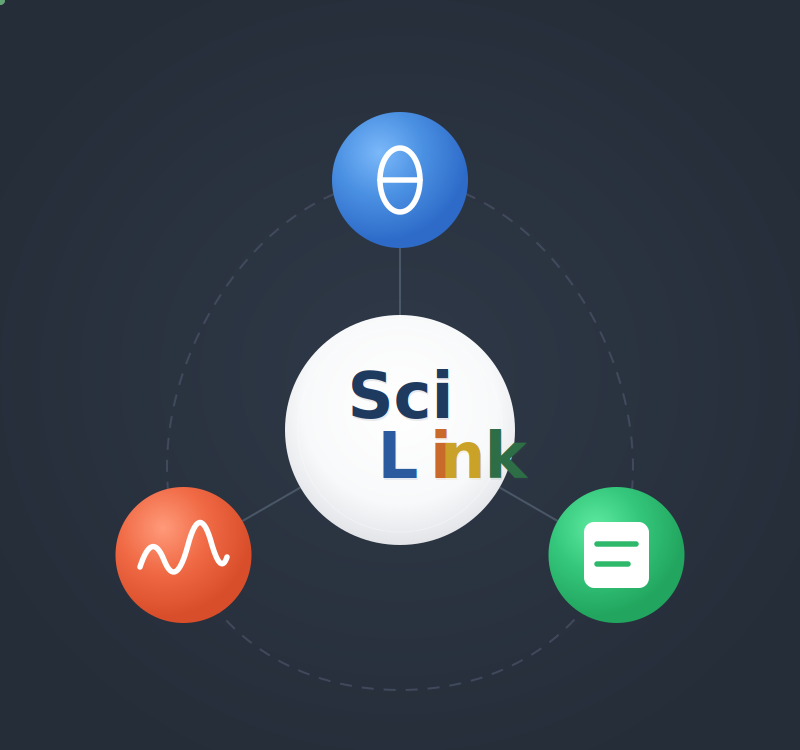
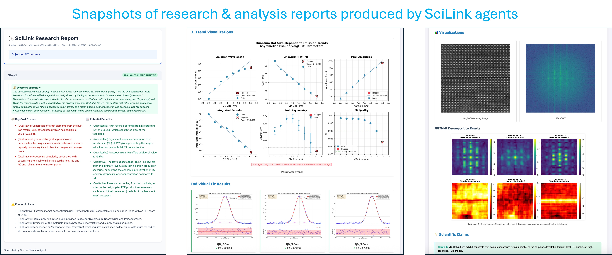
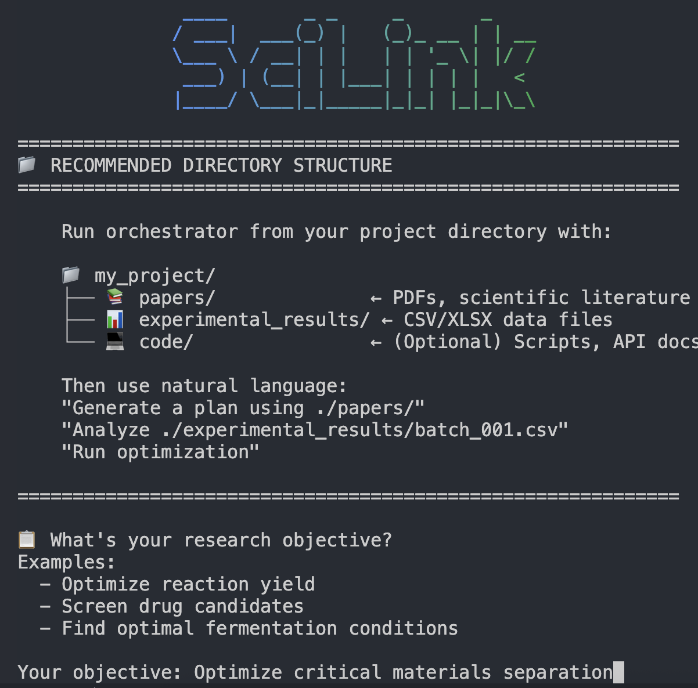
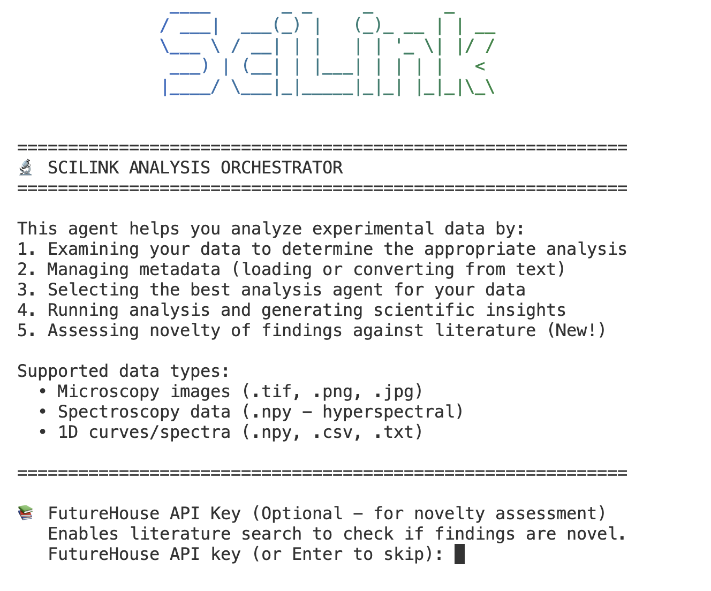

# SciLink

**AI-Powered Scientific Research Automation Platform**



SciLink employs a system of intelligent agents to automate experimental design, data analysis, and iterative optimization workflows. Built around large language models with domain-specific tools, these agents act as AI research partners that can plan experiments, analyze results across multiple modalities, and suggest optimal next steps.

---

## Overview

SciLink provides three complementary agent systems that cover the full scientific research cycle:

| System | Purpose | Key Capabilities |
|--------|---------|------------------|
| **Planning Agents** | Experimental design & optimization | Hypothesis generation, Bayesian optimization, literature-aware planning |
| **Analysis Agents** | Multi-modal data analysis | Image analysis, spectroscopy, hyperspectral datacubes, curve fitting |
| **Simulation Agents** | Computational modeling | DFT calculations, classical MD (LAMMPS), structure recommendations |

---

## Core Capabilities

- **RAG over your knowledge base.** User-supplied papers, project notes,
  instrument manuals, and prior results are indexed and retrieved to ground
  hypothesis generation and experiment design.

- **Agentic Knowledge Query.** Complements RAG for *structured* data —
  tabular files and record databases. The agent generates and executes
  query code dynamically, no upfront schema definition required. Two
  depths share the same machinery: `query_knowledge_data` for ad-hoc
  exploration (*"what fields exist?"*, *"value range of X?"*) and
  `screen_database` for production filter-and-rank passes with a
  structured top-K output.

- **Tools + code.** Pre-built or user-provided tools (such as pre-trained
  ML models) combine with on-the-fly code generation to produce runnable
  analysis scripts, simulation input decks, or lab-automation protocols.
  Executors run locally, on HPC, or on lab instruments.

- **Pluggable skill bundles.** Domain experts extend the platform to new
  instrument data types or simulation methods by contributing self-contained
  markdown files (plus optional Python helpers). The platform discovers
  and routes to them automatically — no core-agent changes required.

- **Three autonomy levels.** **Co-Pilot** (human leads, reviews every step),
  **Autopilot** (AI leads, human reviews major decisions), and **Autonomous**
  (no human review). The mode selects who holds the acceptance gate on
  agent commitments.

- **Simulated-annealing agentic pipelines.** Hold domain priors strictly
  at first, then progressively thaw the lock on the implementation plan
  and domain-rule strictness only when iterative refinements fail to
  converge — inspired by Metropolis–Hastings, with verifier-driven acceptance.

---

## Installation

```bash
pip install scilink

# With web UI
pip install scilink[ui]

# With simulation dependencies (ASE, atomate2, etc.)
pip install scilink[sim]
```

The analysis agents work without additional dependencies, but installing Meta's [Segment Anything Model](https://github.com/facebookresearch/segment-anything) (SAM) enables more advanced particle and grain segmentation. SAM is not available on PyPI and must be installed from source:

```bash
pip install git+https://github.com/facebookresearch/segment-anything.git
```

### Environment Variables

Set API keys for your preferred LLM provider:

```bash
# Google Gemini (default)
export GEMINI_API_KEY="your-key"

# OpenAI
export OPENAI_API_KEY="your-key"

# Anthropic
export ANTHROPIC_API_KEY="your-key"

# OpenAI-compatible proxy (if applicable)
export SCILINK_API_KEY="your-key"
```

When using `SCILINK_API_KEY`, also provide a `--base-url` pointing to your OpenAI-compatible endpoint.

---

## Tracing

By default SciLink records nothing about individual LLM calls. Enable tracing to append one JSON
record per call — model, prompt messages, response text, token usage, and latency — to a JSONL file.
Useful for cost accounting, model comparison, and variability / reproducibility studies.

```python
import scilink
scilink.enable_tracing("run/llm_trace.jsonl")   # or: export SCILINK_TRACE_FILE=run/llm_trace.jsonl
# ... run agents / workflows ...
scilink.disable_tracing()
```

Each line of the trace is a JSON object:

```json
{"timestamp": "...", "model": "...", "messages": [...], "response_text": "...",
 "finish_reason": "stop",
 "usage": {"prompt_tokens": 0, "completion_tokens": 0, "total_tokens": 0},
 "latency_s": 0.0}
```

Tracing is global and opt-in — nothing is recorded unless you enable it. Inline image payloads are
collapsed to `<image>` so traces stay small.

---

## Quick Start

SciLink can be used via the **CLI**, **web UI**, **MCP server**, or **Python API**.

### CLI

```bash
# Planning session
scilink plan
scilink plan --autonomy autopilot --data-dir ./results --knowledge-dir ./papers

# Analysis session
scilink analyze
scilink analyze --data ./sample.tif --metadata ./metadata.json
```

### Web UI

```bash
scilink ui
```

Requires `pip install scilink[ui]`.

### MCP Server

```bash
scilink serve --model claude-opus-4-6
```

See [MCP Integration](#mcp-integration) for details.

### Python API

```python
from scilink.agents.planning_agents import PlanningAgent
from scilink.agents.exp_agents import AnalysisOrchestratorAgent, AnalysisMode

# Generate an experimental plan
planner = PlanningAgent(model_name="claude-opus-4-6")
plan = planner.propose_experiments(
    objective="Optimize lithium extraction yield",
    knowledge_paths=["./literature/"],
    primary_data_set={"file_path": "./composition_data.xlsx"}
)

# Analyze image data
analyzer = AnalysisOrchestratorAgent(analysis_mode=AnalysisMode.AUTOPILOT)
result = analyzer.chat("Analyze ./stem_image.tif and generate scientific claims")
```

---



---

## MCP Integration

SciLink supports the [Model Context Protocol](https://modelcontextprotocol.io/) (MCP) as both a **server** (exposing its tools/agents to external clients like Claude Code) and a **client** (connecting to external MCP servers for additional capabilities).

### As an MCP Server

Expose SciLink's analysis and planning tools to any MCP-compatible client:

```bash
# Default (stdio transport, autonomous mode)
scilink serve --model claude-opus-4-6

# Analysis only, with human approval for major actions
scilink serve --mode analyze --autonomy co-pilot

# HTTP transport (SSE)
scilink serve --transport sse --host 127.0.0.1 --port 8000
```

The server exposes all orchestrator tools (prefixed `scilink_` for analysis, `scilink_plan_` for planning), plus job management tools for long-running operations. Autonomy modes control which tools require human approval before execution. See [docs/claude_code_integration.md](docs/claude_code_integration.md) for the full MCP server guide.

### As an MCP Client

Connect external MCP servers to extend SciLink with additional tools:

```bash
# Python MCP server (e.g., arXiv paper search)
scilink analyze --mcp stdio:arxiv:python,-m,arxiv_mcp_server,--storage-path,/tmp/papers
```

Programmatically:

```python
orchestrator = AnalysisOrchestratorAgent()
tool_count = orchestrator.connect_mcp_server(
    server_name="arxiv",
    command=["python", "-m", "arxiv_mcp_server", "--storage-path", "/tmp/papers"]
)
```

In the **web UI**, go to the **Tools** tab > **MCP Servers** section, select a transport (stdio/SSE), enter the server name and command, and click **Connect**.

See [docs/mcp_client_integration.md](docs/mcp_client_integration.md) for the full MCP guide.

---

## Extensibility

SciLink supports custom tools, skills, and agents that can be added via CLI flags, the web UI, or programmatically.

### Custom Tools

Provide a Python file with `tool_schemas` (list of OpenAI-format tool dicts) and a `create_tool_functions(data)` factory:

```bash
scilink analyze --tools ./my_image_tools.py
```

See [docs/custom_tools_integration.md](docs/custom_tools_integration.md) for the full guide, including how custom tool outputs flow into built-in agents and how to feed a preprocessed file back into the analysis pipeline.

### Custom Skills

Add domain-specific analysis guidance via Markdown skill files:

```bash
scilink analyze --skills ./raman_skill.md ./ftir_skill.md
```

Built-in skills are available for image analysis (atomic-resolution STEM, etc.), curve fitting (XPS, Raman, etc.), and hyperspectral analysis (EELS, etc.).

### Custom Agents

Register additional `BaseAnalysisAgent` subclasses:

```bash
scilink analyze --agents ./my_xrd_agent.py
```

---

# Planning Agents



The Planning Agents module automates experimental design, data analysis, and iterative optimization workflows.

## Architecture

```
PlanningOrchestratorAgent (main coordinator)
├── PlanningAgent (scientific strategy)
│   ├── Dual KnowledgeBase (Docs KB + Code KB)
│   ├── RAG Engine (retrieval-augmented generation)
│   └── Literature Agent (external search)
├── ScalarizerAgent (raw data → scalar metrics)
└── BOAgent (Bayesian optimization)
```

| Agent | Purpose |
|-------|---------|
| **PlanningOrchestratorAgent** | Coordinates the full experimental workflow via natural language |
| **PlanningAgent** | Generates experimental strategies using dual knowledge bases |
| **ScalarizerAgent** | Converts raw data (CSV, Excel) into optimization-ready metrics |
| **BOAgent** | Suggests optimal parameters via Bayesian Optimization |

## CLI Usage

```bash
scilink plan
scilink plan --autonomy autopilot --data-dir ./results --knowledge-dir ./papers
scilink plan --model claude-opus-4-5
```

### Interactive Session Example

```
$ scilink plan

📋 What's your research objective?
Your objective: Optimize lithium extraction from brine

👤 You: Generate a plan using papers in ./literature/

🤖 Agent: ⚡ Generating Initial Plan...
    📚 Retrieved 8 document chunks.

🔬 EXPERIMENT 1: pH-Controlled Selective Precipitation
> 🎯 Hypothesis: Adjusting pH to 10-11 will selectively precipitate Mg(OH)₂ while retaining Li⁺

👤 You: Analyze ./results/batch_001.csv and run optimization

🤖 Agent: [calls analyze_file → {"metrics": {"yield": 78.5}}]
  [calls run_optimization → {"recommended_parameters": {"temp": 85.2, "pH": 6.8}}]
```

### CLI Commands

| Command | Description |
|---------|-------------|
| `/help` | Show available commands |
| `/tools` | List all available agent tools |
| `/files` | List files in workspace |
| `/state` | Show current agent state |
| `/autonomy [level]` | Show or change autonomy level |
| `/checkpoint` | Save session checkpoint |
| `/quit` | Exit session |

## Python API

```python
from scilink.agents.planning_agents.planning_orchestrator import (
    PlanningOrchestratorAgent, AutonomyLevel
)
from scilink.agents.planning_agents import PlanningAgent, ScalarizerAgent, BOAgent

# Using the orchestrator
orchestrator = PlanningOrchestratorAgent(
    objective="Optimize reaction yield",
    autonomy_level=AutonomyLevel.AUTOPILOT,
    data_dir="./experimental_results",
    knowledge_dir="./papers"
)
response = orchestrator.chat("Generate initial plan and analyze batch_001.csv")

# Direct agent usage
agent = PlanningAgent(model_name="claude-opus-4-6")
plan = agent.propose_experiments(
    objective="Screen precipitation conditions",
    knowledge_paths=["./literature/"],
    primary_data_set={"file_path": "./composition_data.xlsx"}
)

# Bayesian optimization
bo = BOAgent(model_name="claude-opus-4-6")
result = bo.run_optimization_loop(
    data_path="./optimization_data.csv",
    objective_text="Maximize yield while minimizing cost",
    input_cols=["Temperature", "pH", "Concentration"],
    input_bounds=[[20, 80], [6, 10], [0.1, 2.0]],
    target_cols=["Yield"],
    batch_size=1
)
```

---

# Experimental Analysis Agents



The Analysis Agents module provides automated scientific data analysis across multiple modalities.

## Architecture

```
AnalysisOrchestratorAgent (main coordinator)
├── CurveFittingAgent (ID: 0)
├── ImageAnalysisAgent (ID: 1)
└── HyperspectralAnalysisAgent (ID: 2)
```

| ID | Agent | Use Case |
|----|-------|----------|
| 0 | **CurveFittingAgent** | 1D fitting — XRD, UV-Vis, PL, DSC, TGA, kinetics |
| 1 | **ImageAnalysisAgent** | All image types — microscopy, SEM, TEM, AFM, optical. Handles atomic resolution, grains, particles, textures, defects, morphology |
| 2 | **HyperspectralAnalysisAgent** | Spectroscopic datacubes — EELS-SI, EDS, Raman imaging |

> **Beta:** ImageAnalysisAgent is under active development. Expect rough edges: verification scores and planner choices can vary across runs, and some domain-specific defaults are still being tuned. Feedback welcome.

## CLI Usage

```bash
scilink analyze
scilink analyze --data ./sample.tif --metadata ./metadata.json
scilink analyze --mode autonomous --data ./spectrum.npy
```

### Interactive Session Example

```
$ scilink analyze --data ./stem_image.tif

👤 You: Examine my data and suggest an analysis approach

🤖 Agent: ⚡ Examining data at ./stem_image.tif...
  • Type: microscopy, Shape: 2048 x 2048
  • Suggested agent: ImageAnalysisAgent (1)

👤 You: Run the analysis

🤖 Agent: ⚡ Running analysis...
  Tier 1: Detected atomic columns with two distinct intensity populations.
  Tier 2 recommended — sublattice separation and displacement field analysis.
  **Scientific Claims Generated:** 3
```

### CLI Commands

| Command | Description |
|---------|-------------|
| `/help` | Show available commands |
| `/tools` | List orchestrator tools |
| `/agents` | List analysis agents with descriptions |
| `/status` | Show session state |
| `/mode [level]` | Show or change analysis mode |
| `/schema` | Show metadata JSON schema |
| `/quit` | Exit session |

## Python API

```python
from scilink.agents.exp_agents import (
    AnalysisOrchestratorAgent, AnalysisMode,
    ImageAnalysisAgent, HyperspectralAnalysisAgent, CurveFittingAgent
)

# Using the orchestrator
orchestrator = AnalysisOrchestratorAgent(
    base_dir="./my_analysis",
    analysis_mode=AnalysisMode.AUTOPILOT
)
response = orchestrator.chat("Examine ./data/sample.tif")

# Direct image analysis with two-tier pipeline
agent = ImageAnalysisAgent(analysis_depth="auto")
result = agent.analyze(
    "stem_image.tif",
    system_info={"experiment": {"technique": "HAADF-STEM"}},
    objective="Identify crystal phases and defects"
)

# Image series with outlier detection
result = agent.analyze(
    ["img_001.tif", "img_002.tif", "img_003.tif"],
    series_metadata={"variable": "dose", "values": [1e14, 1e15, 1e16], "unit": "ions/cm²"}
)

# Curve fitting
agent = CurveFittingAgent(output_dir="./curve_output", use_literature=True)
result = agent.analyze(
    ["pl_300K.csv", "pl_350K.csv", "pl_400K.csv"],
    series_metadata={"variable": "temperature", "values": [300, 350, 400], "unit": "K"}
)
```

### Metadata Conversion

```python
from scilink.agents.exp_agents import generate_metadata_json_from_text

# "HAADF-STEM of MoS2 monolayer, 50nm FOV, 300kV"
# → {"experiment_type": "Microscopy", "experiment": {"technique": "HAADF-STEM"}, ...}
metadata = generate_metadata_json_from_text("./experiment_notes.txt")
```

---

## Novelty Assessment

SciLink can automatically check experimental findings against the scientific literature to identify what's genuinely new. This is powered by integration with [FutureHouse](https://www.futurehouse.org/) AI agents.

```
👤 You: Assess novelty of these claims

🤖 Agent: ⚡ Searching literature via FutureHouse...

  📚 [Score 2/5] Mixed 2H/1T phase coexistence → Well-documented
  🤔 [Score 3/5] Sulfur vacancy density of 3.2 × 10¹³ cm⁻² → Similar measurements exist
  🌟 [Score 4/5] 1T phase localized within 5nm of grain boundaries → Limited prior reports

  Summary: 1 HIGH-NOVELTY finding identified
```

The discovery loop: **Analysis** generates scientific claims → **Novelty Assessment** scores each against literature → **Recommendations** prioritize validation experiments for novel findings.

---

## Output Structure

### Planning Session

```
campaign_session/
├── optimization_data.csv      # Accumulated experimental data
├── plan.json                  # Current experimental plan
├── plan.html                  # Rendered plan visualization
├── checkpoint.json            # Session state for restoration
└── output_scripts/            # Generated automation code
```

### Analysis Session

```
analysis_session/
├── results/
│   └── analysis_{dataset}_{agent}_{timestamp}/
│       ├── metadata_used.json
│       ├── analysis_results.json
│       ├── visualizations/
│       └── report.html
├── chat_history.json
└── checkpoint.json
```

---

# Simulation Agents

Drives atomistic simulations from natural-language research goals. The DFT (VASP) side is the most developed; LAMMPS-side agents (`LAMMPSSimulationAgent`, `LAMMPSAnalysisAgent`, `LAMMPSOrchestrator`) provide an analogous structure for classical MD.

## DFT (VASP)

| Agent | Purpose |
|-------|---------|
| `DFTOrchestrator` | Generate POSCAR / INCAR / KPOINTS from a natural-language description |
| `VaspUpdater` | Recover from failed runs by proposing corrected inputs from VASP error logs |
| `VaspQualityAgent` | Post-run quality assessment with structured findings + recommendations |

### Skill graduation

Sim-side agents support **on-the-fly skill graduation** — record an observation during a run, crystallize it into a Markdown skill that's automatically loaded into agent context on subsequent runs. No code changes needed to teach the agents new domain rules.

```python
qa = VaspQualityAgent()
kid = qa.record_knowledge({
    "summary": "ALGO=All + ISMEAR=-5 produces a tetrahedron-not-variational warning",
    "fix": "Use ALGO=Normal with tetrahedron, or switch ISMEAR=0 with ALGO=All",
})
qa.graduate_to_skill(kid)
# → ~/.scilink/graduated_skills/vasp/<name>/<name>.md, auto-loaded next run
```

### Python API

```python
from scilink.agents.sim_agents.dft_orchestrator import DFTOrchestrator
from scilink.agents.sim_agents.vasp_quality import VaspQualityAgent
from scilink.agents.sim_agents.vasp_updater import VaspUpdater

# Generate inputs from a description
orch = DFTOrchestrator(generator_model="claude-opus-4-6")
result = orch.run_complete_workflow(
    "diamond Si, 2-atom primitive cell, ground-state SCF"
)

# Quality check on a converged run
qa = VaspQualityAgent()
quality = qa.run_quality_check(
    output_dir=result["output_directory"],
    research_goal="diamond Si ground-state SCF",
)

# Recover from a failure
updater = VaspUpdater()
fix = updater.refine_inputs(
    poscar_path="POSCAR", incar_path="INCAR", kpoints_path="KPOINTS",
    vasp_log=open("vasp.out").read(),
    original_request="diamond Si ground-state SCF",
)
```

### Example scripts

End-to-end pipelines under [`examples/vasp/`](examples/vasp/):

- `benchmark_suite.py` — generate VASP inputs for a registry of systems + per-case SLURM scripts.
- `breakage_benchmark.py` — engineered-failure harness for testing `VaspUpdater` against known error classes.
- `e2e_pipeline.py` — post-cluster pipeline: classify each result, run the quality agent or updater, optionally graduate observations to skills.
