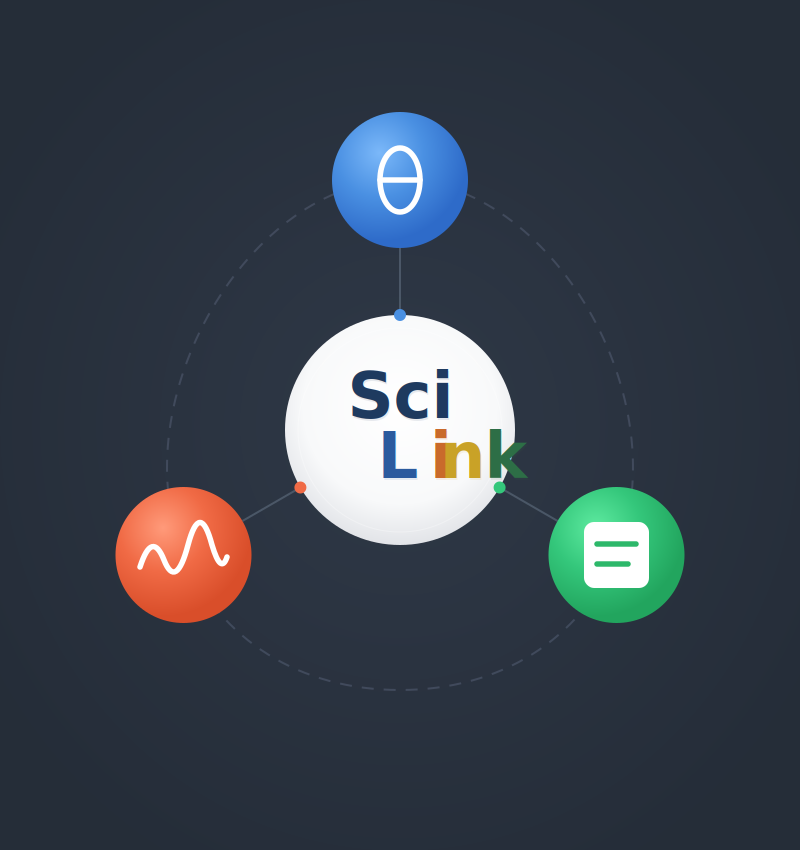

# SciLink

**AI-Powered Scientific Research Automation Platform**



SciLink employs a system of intelligent agents to automate experimental design, data analysis, and iterative optimization workflows. Built around large language models with domain-specific tools, these agents act as AI research partners that can plan experiments, analyze results across multiple modalities, and suggest optimal next steps.

---

## Overview

SciLink provides three complementary agent systems that cover the full scientific research cycle:

| System | Purpose | Key Capabilities |
|--------|---------|------------------|
| **Planning Agents** | Experimental design & optimization | Hypothesis generation, Bayesian optimization, literature-aware planning |
| **Analysis Agents** | Multi-modal data analysis | Microscopy, spectroscopy, particle segmentation, curve fitting |
| **Simulation Agents** | Computational modeling | DFT calculations, classical MD (LAMMPS), structure recommendations |

All systems support configurable autonomy levels—from co-pilot mode where humans lead and AI assists, to fully autonomous operation where the agent chains all tools independently.

---

## Installation

```bash
pip install scilink
```

### Environment Variables

Set API keys for your preferred LLM provider:

```bash
# Google Gemini (default)
export GEMINI_API_KEY="your-key"

# OpenAI
export OPENAI_API_KEY="your-key"

# Anthropic
export ANTHROPIC_API_KEY="your-key"

# Internal proxy (if applicable)
export SCILINK_API_KEY="your-key"
```

---

## Quick Start

### Planning a New Experiment

```bash
# Interactive planning session
scilink plan

# With specific settings
scilink plan --autonomy supervised --data-dir ./results --knowledge-dir ./papers
```

### Analyzing Experimental Data

```bash
# Interactive analysis session
scilink analyze

# With data file
scilink analyze --data ./sample.tif --metadata ./metadata.json
```

### Python API

```python
from scilink.agents.planning_agents import PlanningAgent, BOAgent
from scilink.agents.exp_agents import AnalysisOrchestratorAgent, AnalysisMode

# Generate an experimental plan
planner = PlanningAgent(model_name="gemini-2.0-flash")
plan = planner.propose_experiments(
    objective="Optimize lithium extraction yield",
    knowledge_paths=["./literature/"],
    primary_data_set={"file_path": "./composition_data.xlsx"}
)

# Analyze microscopy data
analyzer = AnalysisOrchestratorAgent(
    analysis_mode=AnalysisMode.SUPERVISED
)
result = analyzer.chat("Analyze ./stem_image.tif and generate scientific claims")
```

---

# Planning Agents

The Planning Agents module provides an AI-powered research orchestration system that automates experimental design, data analysis, and iterative optimization workflows.

## Architecture

```
PlanningOrchestratorAgent (main coordinator)
├── PlanningAgent (scientific strategy)
│   ├── Dual KnowledgeBase (Docs KB + Code KB)
│   ├── RAG Engine (retrieval-augmented generation)
│   └── Literature Agent (external search)
├── ScalarizerAgent (raw data → scalar metrics)
└── BOAgent (Bayesian optimization)
```

| Agent | Purpose |
|-------|---------|
| **PlanningOrchestratorAgent** | Coordinates the full experimental workflow via natural language |
| **PlanningAgent** | Generates experimental strategies using dual knowledge bases |
| **ScalarizerAgent** | Converts raw data (CSV, Excel) into optimization-ready metrics |
| **BOAgent** | Suggests optimal parameters via Bayesian Optimization |

### Autonomy Levels

- **Co-Pilot** (default): Human leads, AI assists. Reviews every step.
- **Supervised**: AI leads, human reviews plans/code only.
- **Autonomous**: Full autonomy, no human review.

## CLI Usage

```bash
# Start interactive planning session
scilink plan

# Supervised mode with workspace config
scilink plan --autonomy supervised \
  --data-dir ./experimental_results \
  --knowledge-dir ./papers \
  --code-dir ./opentrons_api

# Use a specific model
scilink plan --model gpt-4o
scilink plan --model claude-sonnet-4-20250514
```

### Interactive Session Example

```
$ scilink plan

📋 What's your research objective?
Your objective: Optimize lithium extraction from brine

🔧 Initializing agent...
✅ Agent ready!

============================================================
💬 CHAT SESSION STARTED
============================================================

👤 You: Generate a plan using papers in ./literature/

🤖 Agent: I'll generate an experimental plan using your literature.

  ⚡ Tool: Generating Initial Plan...
    📚 Knowledge sources: ['./literature/']
    ✅ Retrieved 8 document chunks.

============================================================
✅ PROPOSED EXPERIMENTAL PLAN
============================================================

🔬 EXPERIMENT 1: pH-Controlled Selective Precipitation
--------------------------------------------------------------------------------
> 🎯 Hypothesis:
> Adjusting pH to 10-11 will selectively precipitate Mg(OH)₂ while retaining Li⁺

--- 🧪 Experimental Steps ---
 1. Prepare 50mL aliquots of brine sample
 2. Add NaOH dropwise while monitoring pH
 3. Filter precipitate through 0.45μm membrane
 4. Analyze filtrate via ICP-OES

📝 Press [ENTER] to approve or type feedback:

👤 You: Add implementation code using ./opentrons_api/

🤖 Agent: [calls generate_implementation_code]
    → Builds Code KB from ./opentrons_api/
    → Maps steps to API calls
    → Generates Python scripts
    ✅ Scripts saved to ./output_scripts/

👤 You: Analyze ./results/batch_001.csv and run optimization

🤖 Agent: [calls analyze_file]
    → Generates analysis script
    → Returns: {"metrics": {"yield": 78.5}}

  [calls run_optimization]
    → Bayesian Optimization with 3 data points
    → Returns: {"recommended_parameters": {"temp": 85.2, "pH": 6.8}}

👤 You: /quit
👋 Session saved at: ./campaign_session
```

### CLI Commands

| Command | Description |
|---------|-------------|
| `/help` | Show available commands |
| `/tools` | List all available agent tools |
| `/files` | List files in workspace |
| `/state` | Show current agent state |
| `/autonomy [level]` | Show or change autonomy level |
| `/checkpoint` | Save session checkpoint |
| `/quit` | Exit session |

## Python API

### Using the Orchestrator

```python
from scilink.agents.planning_agents.planning_orchestrator import (
    PlanningOrchestratorAgent, 
    AutonomyLevel
)

orchestrator = PlanningOrchestratorAgent(
    objective="Optimize reaction yield",
    autonomy_level=AutonomyLevel.SUPERVISED,
    data_dir="./experimental_results",
    knowledge_dir="./papers"
)

response = orchestrator.chat("Generate initial plan and analyze batch_001.csv")
```

### Using Individual Agents

#### PlanningAgent - Experimental Design

```python
from scilink.agents.planning_agents import PlanningAgent

agent = PlanningAgent(model_name="gemini-2.0-flash")

plan = agent.propose_experiments(
    objective="Screen precipitation conditions for magnesium recovery",
    knowledge_paths=["./literature/", "./protocols.pdf"],
    code_paths=["./opentrons_api/"],
    primary_data_set={"file_path": "./composition_data.xlsx"},
    enable_human_feedback=True
)

# Iterate based on results
updated_state = agent.update_plan_with_results(
    results=["./results/batch_001.csv", "./plots/yield_curve.png"]
)
```

#### ScalarizerAgent - Data Analysis

```python
from scilink.agents.planning_agents import ScalarizerAgent

scalarizer = ScalarizerAgent(model_name="gemini-2.0-flash")

result = scalarizer.scalarize(
    data_path="./data/hplc_run_001.csv",
    objective_query="Calculate peak area and purity percentage",
    enable_human_review=True
)

print(f"Metrics: {result['metrics']}")
# {'peak_area': 12504.2, 'purity_percent': 98.5}
```

#### BOAgent - Bayesian Optimization

```python
from scilink.agents.planning_agents import BOAgent

bo = BOAgent(model_name="gemini-2.0-flash")

result = bo.run_optimization_loop(
    data_path="./optimization_data.csv",
    objective_text="Maximize yield while minimizing cost",
    input_cols=["Temperature", "pH", "Concentration"],
    input_bounds=[[20, 80], [6, 10], [0.1, 2.0]],
    target_cols=["Yield"],
    batch_size=1
)

print(f"Next parameters: {result['next_parameters']}")
# {'Temperature': 65.2, 'pH': 8.3, 'Concentration': 1.2}
```

---

# Experimental Analysis Agents

The Analysis Agents module provides automated scientific data analysis across multiple modalities—microscopy, spectroscopy, particle segmentation, and curve fitting.

## Architecture

```
AnalysisOrchestratorAgent (main coordinator)
├── FFTMicroscopyAnalysisAgent (ID: 0)
├── SAMMicroscopyAnalysisAgent (ID: 1)
├── HyperspectralAnalysisAgent (ID: 2)
└── CurveFittingAgent (ID: 3)
```

| ID | Agent | Use Case |
|----|-------|----------|
| 0 | **FFTMicroscopyAnalysisAgent** | Microstructure via FFT/NMF—grains, phases, atomic-resolution |
| 1 | **SAMMicroscopyAnalysisAgent** | Particle segmentation—counting, size distributions |
| 2 | **HyperspectralAnalysisAgent** | Spectroscopic datacubes—EELS-SI, EDS, Raman imaging |
| 3 | **CurveFittingAgent** | 1D fitting—XRD, UV-Vis, PL, DSC, kinetics |

### Autonomy Levels

- **Co-Pilot** (default): Human leads, AI assists. Reviews agent selection.
- **Supervised**: AI leads, human approves major decisions.
- **Autonomous**: Full autonomy for complete analysis pipelines.

## CLI Usage

```bash
# Start interactive analysis session
scilink analyze

# With data and metadata
scilink analyze --data ./sample.tif --metadata ./metadata.json

# Autonomous mode
scilink analyze --mode autonomous --data ./spectrum.npy
```

### Interactive Session Example

```
$ scilink analyze --data ./stem_image.tif

============================================================
🔬 SCILINK ANALYSIS ORCHESTRATOR
============================================================

👤 You: Examine my data and suggest an analysis approach

🤖 Agent: I'll examine your data file.

  ⚡ Tool: Examining data at ./stem_image.tif...

  • Type: microscopy
  • Shape: 2048 x 2048 pixels
  • Suggested agents: FFTMicroscopyAnalysisAgent (0) or SAMMicroscopyAnalysisAgent (1)

👤 You: Preview the image and select the best agent

🤖 Agent: Looking at the image, I can see atomic-resolution features with a crystalline lattice.

  ⚡ Tool: Setting agent to 0...

Selected **FFTMicroscopyAnalysisAgent** for microstructure analysis.

👤 You: Convert this to metadata: HAADF-STEM of MoS2, 50nm FOV, 300kV

🤖 Agent: ⚡ Tool: Converting metadata...
    ✅ Metadata saved

👤 You: Run the analysis

🤖 Agent: ⚡ Tool: Running analysis...
    Analysis ID: stem_image_FFT_20250202_143215_001

**Detailed Analysis:**
The HAADF-STEM image reveals MoS2 with predominantly 2H phase structure.
FFT analysis identified four distinct spatial frequency patterns...

**Scientific Claims Generated:** 3

👤 You: What follow-up measurements do you recommend?

🤖 Agent: 
1. **[Priority 1] EELS Spectrum Imaging** - Target sulfur vacancy clusters
2. **[Priority 2] 4D-STEM Strain Mapping** - Quantify grain boundary strain
3. **[Priority 3] Time-Series Imaging** - Assess defect evolution
```

### CLI Commands

| Command | Description |
|---------|-------------|
| `/help` | Show available commands |
| `/tools` | List orchestrator tools |
| `/agents` | List analysis agents with descriptions |
| `/status` | Show session state |
| `/mode [level]` | Show or change analysis mode |
| `/checkpoint` | Save checkpoint |
| `/schema` | Show metadata JSON schema |
| `/quit` | Exit session |

## Python API

### Using the Orchestrator

```python
from scilink.agents.exp_agents import AnalysisOrchestratorAgent, AnalysisMode

orchestrator = AnalysisOrchestratorAgent(
    base_dir="./my_analysis",
    analysis_mode=AnalysisMode.SUPERVISED
)

response = orchestrator.chat("Examine ./data/sample.tif")
response = orchestrator.chat("Select agent 0 and run analysis")
```

### Using Individual Agents

#### FFTMicroscopyAnalysisAgent

```python
from scilink.agents.exp_agents import FFTMicroscopyAnalysisAgent

agent = FFTMicroscopyAnalysisAgent(
    output_dir="./fft_output",
    enable_human_feedback=True
)

# Single image
result = agent.analyze("sample.tif", system_info=metadata)

# Batch/series
result = agent.analyze(
    ["frame_001.tif", "frame_002.tif"],
    series_metadata={"series_type": "time", "values": [0, 10], "unit": "s"}
)

# Get recommendations
recommendations = agent.recommend_measurements(analysis_result=result)
```

#### SAMMicroscopyAnalysisAgent

```python
from scilink.agents.exp_agents import SAMMicroscopyAnalysisAgent

agent = SAMMicroscopyAnalysisAgent(
    output_dir="./sam_output",
    sam_settings={"min_area": 100, "sam_parameters": "sensitive"}
)

result = agent.analyze("nanoparticles.tif")
print(f"Particles: {result['summary']['successful']}")
print(f"Mean area: {result['statistics']['mean_area_pixels']:.1f} px²")
```

#### HyperspectralAnalysisAgent

```python
from scilink.agents.exp_agents import HyperspectralAnalysisAgent

agent = HyperspectralAnalysisAgent(
    output_dir="./hyperspectral_output",
    run_preprocessing=True
)

# 3D datacube: (height, width, energy_channels)
result = agent.analyze(
    "eels_spectrum_image.npy",
    system_info={"experiment": {"technique": "EELS-SI"}},
    structure_image_path="haadf_reference.tif"  # Optional correlation
)
```

#### CurveFittingAgent

```python
from scilink.agents.exp_agents import CurveFittingAgent

agent = CurveFittingAgent(
    output_dir="./curve_output",
    use_literature=True,  # Search for fitting models
    r2_threshold=0.95
)

result = agent.analyze(
    "pl_spectrum.csv",
    system_info={"experiment": {"technique": "Photoluminescence"}},
    hints="Focus on band-edge emission"
)

print(f"Model: {result['model_type']}")
print(f"R²: {result['fit_quality']['r_squared']:.4f}")

# Series with trend analysis
result = agent.analyze(
    ["pl_300K.csv", "pl_350K.csv", "pl_400K.csv"],
    series_metadata={"series_type": "temperature", "values": [300, 350, 400], "unit": "K"}
)
```

### Metadata Conversion

```python
from scilink.agents.exp_agents import generate_metadata_json_from_text

# Convert natural language to structured metadata
metadata = generate_metadata_json_from_text("./experiment_notes.txt")

# Input: "HAADF-STEM of MoS2 monolayer, 50nm FOV, 300kV"
# Output: {"experiment_type": "Microscopy", "experiment": {"technique": "HAADF-STEM"}, ...}
```

---

## Agent Selection Guide

### Planning Agents

| Scenario | Agent/Tool |
|----------|------------|
| Generate experimental strategy | `PlanningAgent.propose_experiments()` |
| Extract metrics from raw data | `ScalarizerAgent.scalarize()` |
| Optimize experimental parameters | `BOAgent.run_optimization_loop()` |
| Full interactive workflow | `PlanningOrchestratorAgent.chat()` |

### Analysis Agents

| Data Type | Agent | When to Use |
|-----------|-------|-------------|
| Microscopy (atomic) | FFT (0) | Grains, phases, lattices, domains |
| Microscopy (particles) | SAM (1) | Counting, sizing, segmentation |
| Hyperspectral | Hyperspectral (2) | EELS-SI, EDS maps, Raman imaging |
| 1D curves | CurveFitting (3) | XRD, PL, DSC, any x-y fitting |

---

```bash
# Use with any provider
scilink plan --model gpt-4o
scilink analyze --model claude-sonnet-4-20250514

# Custom endpoint
scilink plan --base-url https://my-proxy.example.com/v1 --model my-model
```

---

## Output Structure

### Planning Session

```
campaign_session/
├── optimization_data.csv      # Accumulated experimental data
├── plan.json                  # Current experimental plan
├── plan.html                  # Rendered plan visualization
├── checkpoint.json            # Session state for restoration
└── output_scripts/            # Generated automation code
```

### Analysis Session

```
analysis_session/
├── results/
│   └── analysis_{dataset}_{agent}_{timestamp}/
│       ├── metadata_used.json
│       ├── analysis_results.json
│       ├── visualizations/
│       └── report.html
├── chat_history.json
└── checkpoint.json
```

---

## Key Features

### Planning Agents
- **Dual Knowledge Base**: Separate retrieval for scientific literature and implementation code
- **Human-in-the-Loop**: Configurable review points for plans and generated code
- **Self-Correction**: Automatic plan verification and refinement loops
- **Bayesian Optimization**: Single and multi-objective parameter optimization
- **Script Consistency**: Locked analysis scripts ensure reproducible metrics

### Analysis Agents
- **Automatic Agent Selection**: Examines data and routes to appropriate pipeline
- **Quality Control**: Fit quality assessment with automatic retry (CurveFitting)
- **Scientific Claims**: Generates literature-searchable claims with keywords
- **Measurement Recommendations**: Suggests follow-up experiments
- **Series Analysis**: Built-in support for time series, temperature sweeps

### Shared Features
- **Multi-Provider Support**: OpenAI, Gemini, Anthropic via LiteLLM
- **Session Persistence**: Checkpoint/restore for long-running workflows
- **Multimodal Support**: Images, PDFs, Excel, CSV, numpy arrays
- **Flexible Input**: Single files, batch processing, or directories

---

# Simulation Agents *(Coming Soon)*

The Simulation Agents module provides AI-powered computational modeling capabilities, bridging experimental observations with atomistic simulations.

## Planned Capabilities

| Agent | Purpose |
|-------|---------|
| **DFTAgent** | Density Functional Theory workflow automation |
| **MDAgent** | Classical molecular dynamics simulations via LAMMPS |
| **SimulationRecommendationAgent** | Recommends structures and simulation objectives based on experimental analysis (within available DFT/MD methods) |

### Key Features (In Development)

- **Experiment-to-Simulation Pipeline**: Automatically generate simulation input structures from microscopy analysis
- **Defect Modeling**: Create supercells with point defects, grain boundaries, and interfaces identified in images
- **DFT Calculations**: Electronic structure, formation energies, and spectroscopic signatures
- **Classical MD Simulations**: Large-scale dynamics, thermal properties, mechanical response via LAMMPS

### Integration with Analysis Agents

The Simulation Agents will integrate directly with the Analysis Agents. Experimental analysis and interpretation will be used to recommend structures and simulation objectives that provide deeper insight into observed phenomena:

> **Note**: This module is currently being refactored. Check back for updates.
